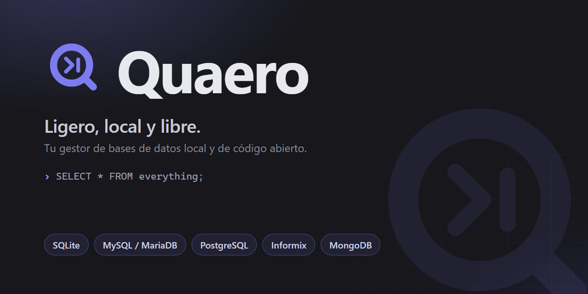
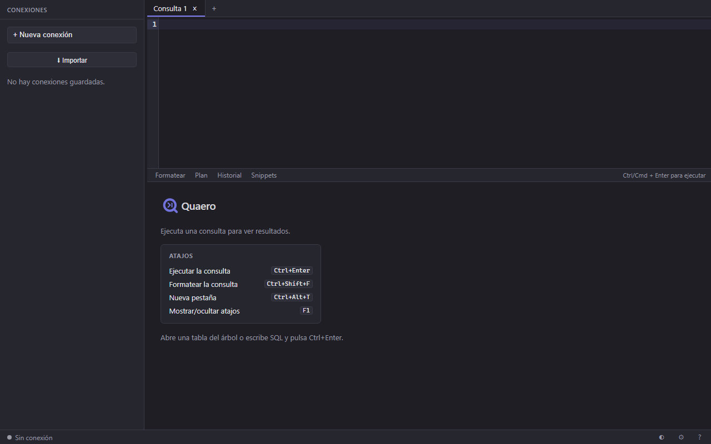

<p align="center">
  
</p>

<p align="center">
  <em>Cliente de bases de datos moderno, ligero y multi-motor — alternativa de código abierto al estilo de Navicat.</em>
</p>

<p align="center">
  <a href="https://github.com/danielnuld/quaero/releases"></a>
  <a href="LICENSE"></a>
  
</p>

**Quaero** (del latín *quaero*, «yo busco/indago») es un cliente de bases de datos
multi-motor con un **núcleo en C** (`libdbcore`) y una **interfaz web sobre el
webview nativo del sistema operativo** (WebView2 en Windows, WebKitGTK en Linux,
WKWebView en macOS). Una UI moderna sin el peso de Electron, y un motor nativo que
habla directo con las librerías cliente de cada base de datos.

## Motores soportados

| Motor | Estado |
|---|---|
| **SQLite** | ✅ Completo (verificado) |
| **MySQL / MariaDB** | ✅ Completo (verificado) — SSL/TLS, túnel SSH |
| **Informix** | ✅ Vía ODBC (build x86) |
| **MongoDB** | ✅ Lectura (find/aggregate, sintaxis mongosh) |
| PostgreSQL, SQL Server, Oracle | ⏳ Planeado (M12) |

Los motores se cargan como **plugins** (`.dll`/`.so`) que implementan un contrato
en C: agregar un motor no requiere tocar el núcleo. Ver
[cómo escribir un driver](docs/WRITING_A_DRIVER.md).

## Funcionalidades

**Editor SQL**
- Editor CodeMirror con **autocompletado** desde el esquema, **formateo** de SQL,
  ejecutar **selección / sentencia / documento**.
- **Historial** de consultas con duración por consulta y marca de lentas.
- **Snippets / favoritos**; **paleta de comandos** (Ctrl/Cmd+K).
- **Plan de ejecución visual** (EXPLAIN) como árbol.

**Grid de resultados**
- Virtualizado, **orden y filtro** por columna, **paginación real** (offset).
- **Edición transaccional** en línea (insert/update/delete + preview del SQL +
  commit/rollback); **detalle de fila** (vista formulario).
- **Exportar** CSV / JSON / SQL / XML / HTML / **XLSX**; **importar** CSV / JSON / XLSX.
- **Gráficos** (barras / líneas / pastel).

**Objetos y diseño**
- Árbol lazy y virtualizado **agrupado por tipo** (tablas, vistas, procedimientos,
  funciones, triggers, eventos).
- **Diseñador de tablas** (crear y ALTER), **editor de índices y constraints**.
- **Procedimientos / funciones**, **triggers / eventos**, **usuarios y permisos**.
- **Monitor de servidor** (lista de procesos + kill), **consultas lentas**.
- **Diagrama ER** (llaves foráneas reales del motor) y **constructor visual de consultas**.

**Datos entre conexiones**
- **Sincronización** de esquema y de datos, **transferencia** de tablas entre
  conexiones, **generación de datos** de prueba.

**Conectividad y plataforma**
- **Túnel SSH** (todos los motores), **SSL/TLS** (MySQL), **import/export** de
  conexiones guardadas.
- Tema **claro/oscuro** con la marca índigo, panel de **Ajustes** y **Acerca de**,
  **atajos de teclado**, menús contextuales adaptativos.
- **Un solo ejecutable** (UI incrustada) + drivers como plugins. Sin Electron.

<p align="center">
  
</p>

## Instalación

**Windows:** descarga el instalador `.msi` más reciente desde
[**Releases**](https://github.com/danielnuld/quaero/releases) y ejecútalo. Requiere
el runtime de **WebView2** (ya incluido en Windows 11). Cada release adjunta un
`SHA256SUMS.txt` para verificar la descarga:
`sha256sum -c SHA256SUMS.txt` (o `CertUtil -hashfile quaero-*.msi SHA256`).

> Linux (AppImage/deb) y macOS (.app) llegan en próximos releases.

## Compilar desde el código

Requisitos: **CMake ≥ 3.20**, un compilador C11 (GCC/Clang/MSVC) y, recomendado,
**Ninja**; **Node + pnpm** para la UI.

```bash
# UI (genera frontend/dist/index.html, un solo archivo que se incrusta)
pnpm --dir frontend install
pnpm --dir frontend build

# Núcleo + app
cmake -S . -B build -G Ninja
cmake --build build
ctest --test-dir build --output-on-failure   # tests del núcleo
```

El binario queda en `build/app/quaero` (`.exe` en Windows). **Dependencias del
webview**: Linux `libgtk-4-dev libwebkitgtk-6.0-dev`; macOS WebKit del sistema;
Windows WebView2 (se descarga al compilar). Para solo el núcleo:
`-DQUAERO_BUILD_APP=OFF`.

**MongoDB:** el driver enlaza `libmongoc`. Si no hay una copia del sistema,
compílalo desde el código con `-DQUAERO_MONGOC=ON` (descarga y enlaza
mongo-c-driver estáticamente; TLS con Secure Channel en Windows).

**Instalador (Windows MSI):** ver [`installer/build-msi.sh`](installer/build-msi.sh)
(WiX v5 vía `dotnet tool`).

**Smoke por motor:** `scripts/smoke/run.sh <sqlite|mysql|mongodb>` — ver
[docs/QA-SMOKE.md](docs/QA-SMOKE.md).

## Arquitectura

```
Frontend (webview del SO)  ──IPC JSON──>  Núcleo en C (libdbcore)  ──vtable──>  Drivers (plugins)
   UI SolidJS, grid virtual,               conexión, queries,                    sqlite, mysql,
   editor SQL, herramientas                introspección, edición, tx            informix, mongodb, …
```

Detalle en [`docs/ARCHITECTURE.md`](docs/ARCHITECTURE.md).

## Documentación

- [ROADMAP](ROADMAP.md) · [Arquitectura](docs/ARCHITECTURE.md)
- [Contrato de drivers](docs/DRIVER_API.md) · [Cómo escribir un driver](docs/WRITING_A_DRIVER.md)
- [Protocolo IPC](docs/IPC.md) · [Atajos](docs/SHORTCUTS.md) · [Versionado](docs/VERSIONING.md)
- [Matriz de verificación](docs/QA-MATRIX.md) · [Marca](assets/brand/BRAND.md)
- [Cómo contribuir](CONTRIBUTING.md)

## Licencia

[GPLv3](LICENSE). Los drivers de motores propietarios se distribuyen como plugins
separados, cargados en tiempo de ejecución, para respetar sus licencias. Inventario
completo de terceros en [THIRD-PARTY.md](THIRD-PARTY.md).
